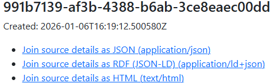
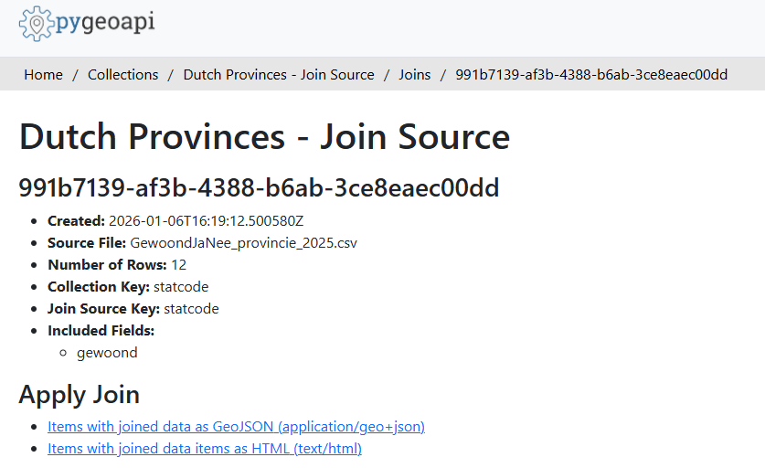
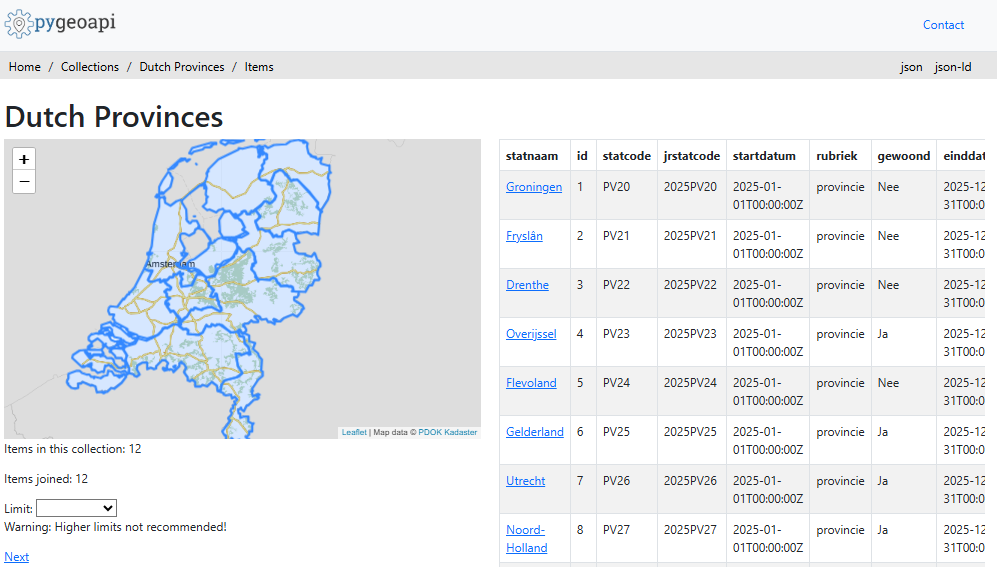
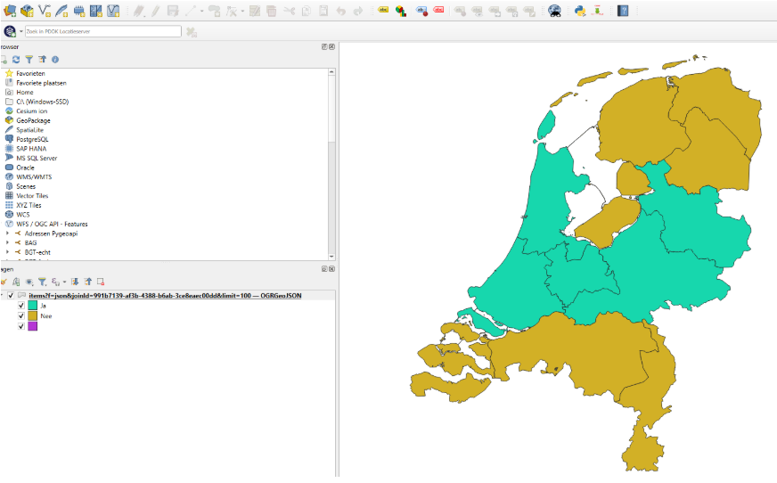

# OGC API - Joins Example Implementation

This page provides information on how to use the [OGC API - Joins](https://ogcapi.ogc.org/joins/) example implementation that has been created for [pygeoapi](https://pygeoapi.io/) as a proof of concept.

The implementation is partially based on the [OGC API - Joins - Part 1: Core](https://docs.ogc.org/DRAFTS/22-026.html) **draft** specification, but deviates in the following ways:
- All joins are collection-based. It's not possible to join 2 arbitrary CSV's.
- As a result, there are no dedicated `/joins` endpoints. These endpoints can now be found at `/collections/{collectionId}/joins`.
- Joins are always performed on-the-fly. The CSV files are preprocessed (indexed) and stored on the backend.
- Instead of persisting the joined result and retrieving it on its own endpoint (leading to redundant data), the results can now be obtained dynamically by adding a `joinId` parameter to the `/collections/{collectionId}/items` endpoint when requesting **features**.
- Because of the dynamic nature of the joins, the endpoint to retrieve all kinds of join metadata is no longer available. Instead, each feature items response page now includes a `joined` parameter (e.g.,on each `Feature` GeoJSON object) that will be `true` if the feature has been joined. For each page (e.g., a GeoJSON `FeatureCollection`), a `numberJoined` parameter is added that tells how many of the returned features have been joined.

## 🛟 How to join a CSV on the join demo server

### Step 1: Navigate to the landing page

Navigate to [https://apitestbed.geonovum.nl/joins_pygeoapi](https://apitestbed.geonovum.nl/joins_pygeoapi) to see the landing page of the service.  
There you'll find the API specification and a link to the available layers (collections).  

### Step 2: Choose a layer to join on

Go to the [collections](https://apitestbed.geonovum.nl/joins_pygeoapi/collections) and choose the layer to which you want to join your CSV.

### Step 3: Determine the key field

For example, you can choose the [nl-provinces](https://apitestbed.geonovum.nl/joins_pygeoapi/collections/nl-provinces) collection. It will list the available key fields on which the join can be performed.

### Step 4: Provide the join details

Via [https://apitestbed.geonovum.nl/joins_pygeoapi/collections/nl-provinces/joins](https://apitestbed.geonovum.nl/joins_pygeoapi/collections/nl-provinces/joins), you can see any previously created joins for this layer. It also offers a form to create your own join by uploading a CSV and providing some details.

#### ⚠️ Note on CSV Encoding

Please make sure to upload CSV files with **UTF-8** encoding, but **without a BOM** (Byte Order Mark).  
Windows users that use Excel to export CSV files may encounter issues due to this added BOM. This is a known problem that will be addressed in the final pygeoapi implementation. 
You may save the CSV without a BOM if possible, or otherwise remove the BOM in a text editor like [Notepad++](https://notepad-plus-plus.org/) for example, by opening the CSV and selecting `Encoding > Convert to UTF-8 (without BOM)`.

### Step 5: Create the join

Press the blue button to create the join:  

  

If all goes well, the created join will be added to the top of the page. The ID of the new join will be displayed at the bottom of the list of joins, along with the links to the results. If there are more than five joins, the oldest one will be deleted automatically.  

  

### Step 6: View the join source details

Click _**Join source details as HTML (text/html)**_ to see the details of the join source data:  

  

### Step 7: View the joined items

Click **_Items with joined data items as HTML (text/html)_** (or the GeoJSON link) to perform the join on-the-fly on the output feature items and view the geometry and properties:  

  
    
The example image above for example can be requested directly via the following URL (where `{UUID}` has to be replaced with the ID of the join you created earlier):  

`https://apitestbed.geonovum.nl/joins_pygeoapi/collections/nl-provinces/items?f=html&joinId={UUID}&limit=12`

**Please note:** if the `joinId` query parameter is omitted, the joined data will not be included. The service then functions as a regular [OGC API - Features](https://ogcapi.ogc.org/features/) service.

If you wish to see the GeoJSON output (instead of the HTML) you can click the **_json_** link in the top right corner of the webpage. The associated URL can then be consumed directly in GIS desktop applications like [QGIS](https://qgis.org/), for example:  

  

---

## Final Notes

### 🚧 Work in progress

Please note that the specification is still taking shape. If you like, you can participate in the discussion on [GitHub](https://github.com/opengeospatial/ogcapi-joins) or [OGC Agora](https://agora.ogc.org/c/discover-standards-working-groups-swg/features-api-swg-f5da28).  
If you wish to contribute to the pygeoapi implementation, you can find the [source code on GitHub](https://github.com/GeoSander/pygeoapi/tree/ogc-api-joins).

### 🙏 Acknowledgements

This work has been funded by [Geonovum](https://www.geonovum.nl/), the National Spatial Data Infrastructure (NSDI) executive committee in the Netherlands.